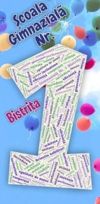

*PRIVIRE DE ANSAMBLU ASUPRA ACTIVITĂȚILOR DESFĂȘURATE ÎN ANII ȘCOLARI 2018-2023 LA CLASELE PRIMARE ÎN ȘCOALA GIMNAZIALĂ NR.1 BISTRIȚA*

&nbsp; Școala Gimnazială Nr.1 Bistrița a fost întotdeauna un gigant școlar, căutată de elevi și părinți, pentru că aici CALITATEA este la ea acasă - e un deziderat care se transmite din generație în generație, e ethos organizațional. Pentru cei mai mulți dintre noi școala absolvită lasă o amprentă clară și rămâne de-a lungul vieții un punct de reper, un tărâm al tumultului de tinerețe și entuziasm care răzbate în timp și peste timpuri.



&nbsp; Seriozitatea, perseverența, dăruirea, profesionalismul, implicarea, spiritul de competiție, capacitatea de empatie sunt doar o parte dintre însușirile care îi caracterizează pe dascălii noștri.
Afirmarea performanței este pentru noi o asumare a unei tradiții, fapt realizat prin făurirea și păstrarea unui prestigiu, prin credința în reușită și mai ales prin statornicie. Am creat un spațiu al misiunii asumate, al viziunii dovedite, în care se construiește cu responsabilitate un destin, destinul acestei școli, cu cadre didactice deosebite și cu minunați elevi.

&nbsp;Învățarea centrată pe elev a făcut ca fiecare dintre noi să concepem și să desfășurăm activități de învățare în concordanță cu particularitățile individuale, dar și cu cerințele standard.
Pentru ca motivația să existe din toate punctele de vedere, fiecare învățător a amenajat spațiul de lucru respectând ambientul corespunzător, vizând un aspect informativ, formativ, estetic, toate acestea facilitând diversificarea formelor de organizare a instruirii conform particularităților de vârstă și individuale.

&nbsp; În lecțiile desfășurate la clasă învățătorii au aplicat tehnici de implicare individuală sau în grup a elevilor, lucrul în perechi sau în grupuri mici, care au condus la participarea efectivă a tuturor elevilor la activitățile propuse, aceștia dobândind capacități de cooperare, de sprijin și colaborare, de primire și asumare de sarcini de lucru în echipă, de respectare a unor reguli stabilite, de asumare a răspunderii individuale și colective, a inițiativei.

&nbsp; Am respectat curba de efort a elevilor, dar și nevoia de reînvățare, ameliorare, dezvoltare. Cadrele didactice au parcurs materia ritmic și integral, aplicând metode și procedee activ-participative la fiecare disciplină de învățământ, conform planificărilor calendaristice proiectate pe unități de învățare. Proiectarea didactică la nivelul fiecărei clase s-a realizat ținând cont de sistemul de relații și dependențe care există între obiectivele operaționale, conținutul științific vehiculat, strategiile de predare-învățare și evaluare, precum și standardele de competență de la sfârșitul ciclului primar. Am avut în vedere relaționarea și interrelaționarea acestor concepte în planificarea materiei la fiecare disciplină de învățământ pentru ca activitatea de instruire și autoinstruire să fie centrată pe elev, pentru mobilizarea elevilor la un efort susținut în procesul învățării prin angajarea optimă a mecanismelor intelectuale ale acestora. Învățătorii au adoptat strategii de provocare și dirijare a gândirii strategii ce oferă condiții optime pentru exersarea intelectului elevilor în direcția flexibilității, creativității, inventivității, conducând la formarea unei gândiri moderne, algoritmice, modelatoare, problematice.

&nbsp; Proiectarea activităților  la nivelul claselor s-a realizat cu scopul dezvoltării de competențe prin însușirea de cunoștințe pe baza abordării transdisciplinare și transcurriculare a conținuturilor programelor școlare. De asemenea, s-a ținut cont de noile reglementări elaborate de MEN și de recomandările primite din partea inspectorilor de specialitate. O atenție deosebită s-a acordat continuării monitorizării elevilor cu probleme în învățare din fiecare colectiv, implicându-i în activități didactice diverse în vederea participării active și conștiente la propria formare, atât pe plan intelectual, dar și pe plan afectiv și psihic.

&nbsp; Permanenta preocupare de a forma competențe necesare învățării continue a dus la desfășurarea de activități diverse, concursuri și serbări școlare, târguri organizate cu ocazia unor sărbători naționale, expoziții de desene, workshop-uri, activități culturale, artistice și sportive organizate la nivel local, județean sau național:

 &nbsp; *Expoziție arhivele naționale; Ora de joc și mișcare în parcul școlii; În atelierul meșterului tâmplar-castelul Teleki; "La cireșe - În livada ta..."; Proiect Primăria Bistrița - "Te invit să-mi cunoști orașul meu, Bistrița"; Brigada de reciclare deșeuri; Expoziția de mamuți și dinozauri – Cluj-Napoca; Grădina botanică Cluj-Napoca; În așteptarea Crăciunului; Ziua României ; La arhivele naționale; La cinematograf în Școala altfel; Săptămâna fructelor și legumelor; Am pornit să colindăm - activitate în cadrul proiectului Instrumente mici, artiști mari; Opțional "Cultură și civilizație la Bistrița"; Activitatea "O legendă, un obiectiv"; Ora de educație rutieră - proiect parteneriat cu Inspectoratul Județean de Poliție; Concert de colinde pe pietonal - organizator Primăria Bistrița; Ziua cititului împreună Biblioteca județeană; Balerina - captarea atenției la o lecție de lectură;Ne prezentăm talentele; Vizită la biblioteca școlii; Bancnote și monede în proiectul "Școala de bani"; Săptămâna educației globale - mâna robotică; Proiect național "Rețeaua prieteniei" ; Săptămâna verde - vizită Aquabis; Săptămâna verde - "Despre albine" cu un invitat special Vârtic Teodor... .*

&nbsp; *Un impact deosebit au avut activitățile din  Proiectul  Național "Copil ca tine sunt și eu…", cele organizate pentru Ziua Mondială a Educației, Ziua Internațională a Profesorului, Ziua Culturii Naționale, Ziua Mondială a Pământului, Ziua Jandarmeriei. S-au desfășurat proiecte tematice, cum ar fi: Ziua Cofetăriilor, Cercul de pictură 2021, Ziua Apei, Visit Bistrița - proiect finanțat de Primăria Bistrița, Crăciun - multiculturalitate în Bistrița, 1 Decembrie 2022 - Drag de România mea, Săptămâna Educației Globale, 1 Iunie, Zici 2022, Tabăra Speranței Herina, Excursii școlare, Sărbători Pascale, Povești adevărate din țara mea.*

***Proiecte educaționale:** - Frumoasă și bogată toamnă; România, te iubesc!, Te iubesc, mămico! Profesor pentru o zi-un trio funcțional; Poveste de Toamnă, Târgul de Crăciun,  Atelierele de vară AMmA Kids.*


Participarea la simpozioane, mese rotunde, conceperea și desfășurarea unor parteneriate educaționale au constituit mijloace eficiente de formare continuă. Educația rămâne metodă și principiu, reprezintă creșterea intelectuală și morală, este autodevenire, este sistem de valori, este mod de gândire, este gen de viață, este devenire și înălțare. Educația este un sistem grație căruia omul și umanitatea pot să crească sau să se autodepășească. Educația dată de școală rămâne ceva specific și esențial.



 &nbsp; Dăruirea, seriozitatea, perseverența, profesionalismul, dragostea pentru copii și profesie sunt atributele dascălilor care predau în învățământul primar.



 &nbsp; Pentru îmbunătățirea calității  activității didactice, pentru ca o școală să fie eficientă, este necesar ca elevii, dascălii și părinții să aibă foarte bine conștientizată misiunea comună, iar activitatea didactică să fie mai mult centrată  pe elev.

&nbsp; **"Educația este ceea ce supraviețuiește după ce tot ce a fost învățat a fost uitat"**. *(Burrhus Frederic Skinner)*

 &nbsp; Responsabil Comisie Metodică Învățători, Prof. *Salanță Daniela*
