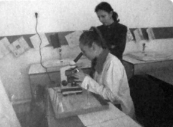
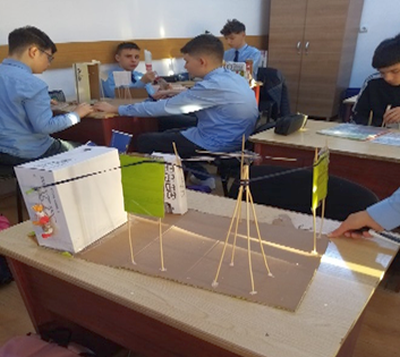

**„Tehnologia este arta de a transforma știința în ceva practic”** - *(Marcio Barrios)*

{.text-center}

La început disciplina a fost cunoscută sub numele de Abilități practice, unde elevii, sub atenta supraveghere a maiștrilor instructori au fost inițiați în tainele cusutului, gătitului (fetele) și prelucrării lemnului (băieții), în ateliere de gastronomie si prelucrare a lemnului.

Începând cu anii 2000, disciplina se numește „Educație tehnologică”, și face parte din aria curriculară Tehnologii și se regăsește atât în planul de învățământ obligatoriu – primar si gimnazial, cât și în cel liceal (filiera tehnologică). Noul curriculum, conceput în structura modulară, asigură flexibilitatea abordării și permite familiarizarea elevilor cu noțiuni din diverse domenii de activitate, ca de exemplu: mediul construit, produse alimentare de origine minerală, vegetală si animală, comunicații și transporturi, energetic, prelucrarea materialelor textile, lemnului, metalelor, lutului și ceramicii, etc.

Din 2017 se numește „Educație tehnologică și aplicații practice” și prin caracterul transdisciplinar oferă deschidere spre asimilarea de cunoștințe din diferite domenii, stimulând gândirea prin analogie și creativitate, asigurând o mai bună percepție a imaginii de ansamblu a realității cotidiene și a perspectivelor pentru viitorul acesteia, în contextul unei dinamici în tehnologie și ecologie. Rolul disciplinei este de a contribui la formarea și educarea elevilor prin cultivarea unui veritabil umanism tehnologic, dezvoltarea spiritului de cercetare, amplificarea capacităților creative, cultivarea unei atitudini și unui comportament ecologic, cunoașterea unor noțiuni de antreprenoriat și a familiilor ocupaționale cu specific tehnologic, pentru o viitoare opțiune socio-profesională, arătându-le că educația tehnologică are un caracter dual specific interdisciplinar-teoretic și practic științific și tehnologic, și-i conștientizează asupra faptului că „Elevul viitorului va fi un explorator”.

{.text-center}

Catedra de Educație tehnologică  și aplicații practice a Școlii Gimnaziale NR.1 Bistrița este formată în prezent doar din doamna profesor-inginer Mirela Mișca, dar de-a lungul timpului au mai activat doamna profesor-inginer Dana Voicu, și maiștrii instructori Neluța Danilescu, Radu Iacob, Ildiko Nagy, Alexandru Ionașcu și Daniela Ferenț.

Elevii au participat la proiecte derulate la nivelul ariei curriculare numite „ȘTIINȚE” (care cuprinde disciplinele Chimie, Fizică, Biologie și Educație Tehnologică), concursuri și olimpiade școlare cu caracter interdisciplinar și de specialitate: Bosbici Oana, Coceșiu Tania, Pavelea Mihai (participanti la faza națională), Tomoioaga Ciprian, Cociș Oana, Cioba Lidia, Cosma Oana, Chirlejan Cristina, Gavri Andreea, Chiticariu Oana, Buzan Dan, etc. Au fost implicați la toate târgurile de Crăciun și de Paște, voluntariate, acțiuni caritabile, excursii cu caracter tematic, proiecte și parteneriate cu școli din municipiu, județ sau chiar alte județe.

Prin toate activitățile menționate și această catedră și-a adus contribuția la creșterea prestigiului școlii pe plan municipal și județean.