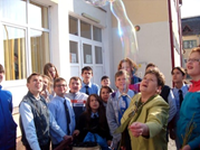
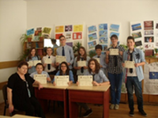
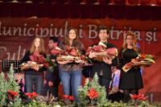

**“Nimic nu este încheiat în investigația umană și nimic nu este ultimul cuvânt.”**   - *(Roger Bacon)*

  
{.text-center}

***Fizica este o ştiinţă a naturii, studiază formele de energie şi transformările lor. A contribuit la progres şi dezvoltare şi va contribui în continuare dar numai printr-o relaţie de pluri-inter-transdiciplinaritate cu celelalte ştiinţe. Fizica de gimnaziu este un abecedar ce conţine  noţiunile de bază cu care elevii vor porni mai departe în marea investigaţie a lumii în care trăim. Pentru înţelegerea şi aprofundarea acestuia s-au ostenit profesori remarcabili care au motivat elevii pentru studiul fizicii şi aplicaţiile ei în viaţa cotidiană.***

Deschiderea activității la Catedra de Fizică a Școlii Gimnaziale Nr. 1, Bistrița a făcut-o doamna profesoară Florentina Orban, în anul 1964. Au urmat apoi profesori deosebiți ca domnul Andrei Hegeduș, (fost inspector de Fizică, la ISJ B-N), doamnele Maria Mureșan, Elena Rebreanu. Au mai trecut temporar și alți  profesori pe la catedra de fizică precum Carmen Cătinean, Rus Andreea, Gentian Ungur. Acum catedra de fizică are doar o normă și jumătate pe care lucrează doamnele profesoare Maria Pop și Mihaela Voivod.

Doamna profesoară Mihaela Voivod a venit în școală în anul 1999 după o experiență acumulată în Emiratele Arabe Unite în domeniul învățământului. Elevii care i-au adus satisfacția muncii au fost: Tatiana Zăpârțan, participantă la faza Națională a Olimpiadei de Fizică, Veronica Bodescu, Andreea Cifor, Andrei Olinca, Andrei Budurlean – elevi cu premii și mențiuni la faza județeană. S-a implicat cu seriozitate în toate activitățile catedrei de Fizică și apoi a celei noi, numită ȘTIINȚE care cuprinde chimia, fizica, biologia, educație tehnologică
Doamna profesoară Mihaela Voivod a efectuat studii de conversie profesională obținând calificare în matematică. Doamna profesoară Maria Pop a  venit în școală în anul școlar 1988-1989, fiind o lungă perioadă de timp „liniuța de valență” între catedrele de fizică și chimie.

De-a lungul timpului elevii noștri au participat la Olimpiada Națională De Fizică: Tomoiagă Ciprian, Uțiu Nichita, Dumbrăvean Bogdan au obținut medalie de argint din partea SRF, iar Petrușca Sergiu medalie de bronz din partea SRF. Merită amintiți și alți olimpici la OJF: Toma Vlad, Dacian Mujdar, Beatrice Ionașcu, Daniel Pop, Ana-Maria Retegan, Cristina Pașcanu, Oana Bosbici, Cezara Zăgrean-Tuza, Oana Cociș, Cristian Marțian, Diana Mărăndel, Denis Pop, Adina Fulop, Iulia Tămaș, Iulia Rebreanu, Bogdan Alexandra, Răzvan Nașca, Daria Serețean, Rareș Ionașc, Cosma Cosmina, Chirleșan Cristina, Ionașcu Iulia, Cator Catinca.

Olimpiada „Ştiinţe pentru Juniori” a adus premii şi menţiuni la nivel judeţean dar şi naţional prin: Cristina Paşcanu, Cezara Zăgrean-Tuza, Tomoiagă Ciprian, Beatrice Ionaşcu, Cristina Marţian, Viviana Chiţimuş, Sergiu Petrușca. Ulterior, în anii de liceu, având experiența particpării la acestă olimpiadă, Sergiu Petrușca a obținut **medalia de aur la faza internațională a olimpiadei**.

Concursul Naţional de Fizică aplicată ”Universul Einstein” a adus în fiecare an premii şi menţiuni speciale. Au contribuit cu lucrări teoretice şi practice:  Dacian Mujdar, Beatrice Ionaşcu, Alexandra Mureşan, Sînzîiana Moldovan, Silviu Mercan, Cristian Haranguş, Cristian Marţian, Claudia Pop, Yolanda Szabo.

Membrii catedrei au fost evaluatori la olimpiade şi concursuri, membri în comisia de organizare a două olimpiade naţionale desfăşurate la Bistriţa, au participat la sesiuni de comunicări ştiinţifice şi simpozioane cu lucrări personale sau îndrumător al elevilor, au scris articole pentru: revista judeţeană „Universul chimiei”, „Didactica Nova”- CCD Bistriţa, ziarul on line Bistriţanews, au organizat expoziţia „Elevii de azi, specialiştii de mâine”cu machete funcţionale şi lucrări ale elevilor, am inițiat și derulat proiectul interjudeţean „Fizica  şi viaţa cotidiană”.

Trebuie amintite, de asemenea:

- concursul ”Science4You” , Concurs Regional la care catedra de științe a obținut multe premii;
- „Scienția Naturalis”, revista catedrei cu care am obținut multe premii I;
- Pagina de Facebook „Fizica și viața cotidiană”;
- diploma de Profesor ALTFEL obținută de doamna Pop MARIA;
- participările la „Ziua Porților Deschise” la Facultatea de Chimie și Facultatea de Fizică, UBB Cluj-Napoca;
- „Muncă-Ocupaţie-Carieră”, proiect educativ  de explorare şi planificare a carierei;
- „Şcoală - elevi – familie”, proiect educativ pentru realizarea unei bune colaborări a şcolii cu părinţii.
