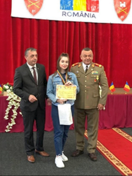
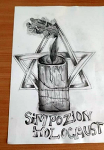
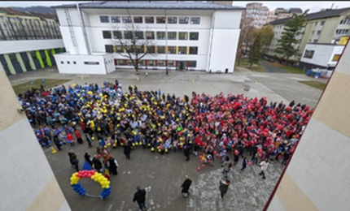

**„Fără istorie nu este patrie și fără dragoste de istorie nu poate fi dragoste către patrie”** - *(Bogdan Petriceicu Hașdeu)*

În decursul celor aproape șase decenii de existență a acestei prestigioase instituții de învățământ, toate cadrele didactice care au activat în cadrul Catedrei de Istorie au avut ca obiectiv de bază a dărui tuturor copiilor care au învățat în băncile școlii noastre știința, priceperea și dragostea de a cunoaște și de a desluși tainele acestei frumoase discipline. Așa cum spune renumitul istoric contemporan Adrian Cioroianu ,, Istoria- cea mai frumoasă poveste” a fost și este predată și astăzi cu mult drag elevilor, de către profesorii inimoși de ieri:
Maria Boca, Elena Iacoban, Dionisie Morar, Florica Mureșan, Sonia Paraschiva, Petra Răchitan,  Livia Serea, Anna Suciu, Sur Genica, Alexandrina Timar, Zsejki Elisabeta și de astăzi: Cosmin Traian Istrate, Mihai Hecktor și Monica Ioana Orban .

Demersul didactic desfășurat de noi, cei de astăzi presupune a răspunde multor provocări conturate de contextul intern, dar mai ales, de cel internațional. Elevii, doritori a cunoaște diferitele cauze ale evenimentelor care se petrec acum în plan internațional sunt mereu curioși și, în același timp, pregătiți să afle și să trăiască pe viu realitățile zilelor noastre, generate de recentul război declanșat de Rusia în Ucraina(24 februarie 2022) și de agresiunea grupării teroriste Hamas asupra statului Israel (7 octombrie 2023). Pentru noi se deschid numeroase oportunități de a discuta și a-i învăța despre momente importante din istoria neamului românesc raportându-ne și asociind aceste momente la realitățile prezente.

Este de la sine înțeles faptul că, orice profesor de Istorie este dedicat istoriei naționale și pentru ca elevii noștri să învețe cu drag despre aceasta noi, cadrele didactice utilizăm toate metodele- clasice și moderne- necesare unei însușiri cât mai facile, plăcute a Istoriei noastre, ca parte integrantă a Istoriei Universale. Provocările contemporane sunt multiple și implică o mare  varietate  de resurse care sunt utilizate în procesul instructiv- educativ. Cu atât mai important este rolul profesorului de istorie care este ,,chemat” să explice, să asocieze, să deslușească ceea ce se petrece astăzi, ca parte a unui întreg numit EDUCATIE, ȘTIINȚĂ, ATITUDINE CORECTĂ FAȚĂ DE VALORILE NAȚIONALE, dar și respect față de valorile culturii universale.

În atenția cadrelor didactice care activează în catedra de Istorie se regăsește însă și pregătirea profesională, formarea continuă, ceea ce implică participarea noastră la diferite cursuri de formare/ perfecționare, la care ne îmbunătățim modul de lucru și dobândim noi competențe. Suntem prezenți de asemenea, la  toate reuniunile profesorilor de istorie: consfătuiri, cercuri pedagogice, sesiuni de referate, diverse întruniri cu caracter istoric.

Suntem de asemenea , interesați de asigurarea unei atitudini de respect pentru trecutul nostru național, de valorificare a zestrei moștenite de la părinți,  bunici și străbunici în rândul elevilor noștri, iar în acest sens îi sprijinim pe cei care se dovedesc interesați să participe la diferite concursuri și manifestări cu caracter istoric. Dintre acestea menționăm: Concursul Județean ,,Patria, Armata Eroul”- ediția I- octombrie 2022, la care eleva Cristina Violeta ENCEAN- clasa aVIII-a A (prof. coord. Monica Ioana Orban) a obținut locul I pe județ; -  la Concursul Județean ,,Ce înseamnă România pentru mine?” organizat de ISJ B-N, în colaborare cu Arhivele Naționale B-N  au participat elevi din mai multe clase și au obținut premii importante: Denisa Iușan- clasa aVIII-a E (prof. coord. Cosmin Traian Istrate)- Premiul Special al Arhivelor- la secțiunea fotografie; elevul Ștefan Armașu- clasa a V-a A (prof. coord. Adina Măgerușan- geografie)- mențiune, la secțiunea fotografie și eleva Cristina Violeta Encean (clasa aVIII-a A, prof. coord. Monica Ioana Orban) Premiul I, la secțiunea videoclip.

  
{.text-center}

{.text-center}

În același demers de cunoaștere și înțelegere a trecutului istoric, desfășurăm cu elevii claselor de gimnaziu activități destinate cinstirii Eroilor neamului, Zilei Naționale a României- Marea Unire, Zilei Micii Uniri, Comemorării Holocaustului etc. . 
