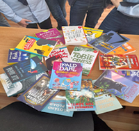
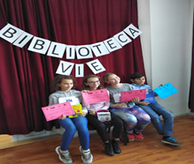
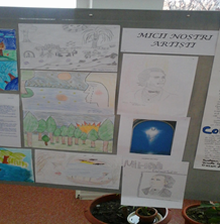
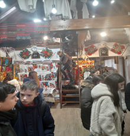

   

 **„S-ar putea crede că întreaga natură a ostenit la zidirea Limbii Române.”** - *(Grigore Vieru)*

*„A vorbi despre limba română este ca o duminică. Limba română este patria mea. De aceea, pentru mine, muntele munte se numește, de aceea, pentru mine, iarba iarbă se spune, de aceea, pentru mine, izvorul izvorăște, de aceea, pentru mine, viața se trăiește.”* ***(Nichita Stănescu)***

Pentru toate popoarele, indiferent de profesiile membrilor societății, gradul de stăpânire și de folosire a limbii reprezintă o trăsătură definitorie a nivelului cultural. Deși la formarea și dezvoltarea limbajului contribuie întreg mediul social și cultural în care se dezvoltă omul, un rol important în perfecționarea exprimării revine școlii și, în cadrul ei, locul de vază îl ocupă studiul limbii.

Limba română constituie o disciplină centrală în procesul de învățământ, având o însemnătate cu totul deosebită în formarea multilaterală a școlarilor. Fără însușirea corespunzătoare a limbii române nu poate fi concepută evoluția intelectuală a elevilor, pregătirea lor corespunzătoare la celelalte obiecte de învățământ, însăși viața și activitatea lor socială viitoare. Într-o cugetarea de o neasemuită frumusețe, Lucian Blaga spunea: *”Limba este întâiul mare poem al unui popor”*.

Studiul literaturii în școală este un proces complex care începe cu însușirea instrumentului tehnic al lecturii, continuă cu formarea capacității de a recepta opera literară, de a o comenta și interpreta, urmărind, în final, formarea gustului estetic . Născută din nevoia sufletului omenesc de a-și exprima emoțiile cele mai puternice, literatura este o artă care îi ajută pe oameni să înțeleagă sensurile adânci ale realității și să și-o însușească sub raport spiritual.
De-a lungul timpului, profesorii de limba și literatura română ai Școlii Gimnaziale Nr. 1 au muncit cu multă dăruire pentru a le transmite zecilor de generații cele mai bune cunoștințe profesorii: Floarea Apian, Ramona Bâltag, Dorina Bradea, Noreta Bude, Gavril Cîmpan, Sorina Costea, Aurora Drăgan, Elisabeta Frenţiu, Ioana Giurgiu, Aurelia Hîruţă, Veronica Horga, Doina Hoza, Maria Ivan, Adriana Jigmond, Mihai Litinski, Maria Moldovan, Alexandru Nagy, Angela Pop, Anisia Pop, Veturia Rusu, Georgeta Tanco, Monia Todea, Doris Savu, Nicoleta  Ştefănescu, Ligia Vultur, Lucia Zaig. Pe lângă activitatea didactică de zi cu zi, dascălii noștri au pregătit suplimentar atât elevii aflați în fața examenelor naționale, cât și pe cei capabili de performanță.

Astăzi, activitatea didactică este susținută de doamnele profesoare: Carmen Burje,  Ancuța Mihaiu – directorul școlii, Simona Mutu, Izabela Pintea, Cristina Trombitaș, Crina Slevoacă.
Astfel, sub îndrumarea profesorilor din catedra de limba română, elevii au participat la diferite olimpiade și concursuri școlare, de unde s-au întors, de fiecare dată, cu numeroase premii și mențiuni atât la etapele județene, cât și la cele naționale: Olimpiada de Limba și Literatura Română, Olimpiada „Lectura ca Abilitate de Viață”, Concursul Interdisciplinar „Cultură şi spiritualitate românească”, Olimpiada de Lingvistică „Solomon Marcus”, Concursul de creație literară „Orizonturi”, Concursul Național Trasnscurricular de Lectură și Interpretare „Ionel Teodoreanu”.
De asemenea, ne mândrim cu rezultate deosebite obținute la disciplina limba și literatura română la examenul de Evaluare Națională, în urma cărora, absolvenții claselor a VIII-a au fost admiși la liceele de top din Bistrița.

 
{.text-center}

În plus, au avut loc și activități extracurriculare, precum „Biblioteca Vie”, proiectul județean „Alege cartea!”, ateliere de lectură, Ziua Internațională a Cititului Împreună – ZICI, participări la lansări de carte, aniversări ale scriitorilor români.
Aceste lucruri au putut fi posibile grație unei echipe de profesori dedicați care au pus întotdeauna munca la catedră mai presus de orice, dar și unei bune colaborări cu toți factorii implicați în educație: elevi, părinți, colegi. Totul este posibil când există implicare, perseverență, muncă și mult suflet!

 
{.text-center}

Povestea merge mai departe…

Cuvinte-cheie: **creativitate, libertate, opinii, comunicare, optimism, cooperare, sensibilitate, inspirație**.

