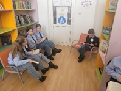
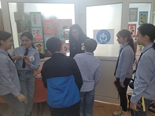
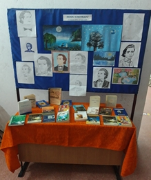
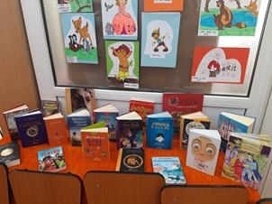

*“A construi o bibliotecă înseamnă a crea o viață. Biblioteca nu va fi niciodată o colecție întâmplătoare de cărți. Fără biblioteci, nu există civilizație”* - **Carlos María Domínguez**

Biblioteca școlară este compartimentul specializat al cărui scop principal este de a constitui, a organiza, a prelucra cărți, publicații periodice, alte documente specifice si baze de date, pentru a facilita utilizarea acestora de către beneficiari in scop de informare, cercetare, educație sau recreere (ORDIN nr. 5.556 din 7 octombrie 2011).

Biblioteca reprezintă pentru școală o carte de vizită. Ea cuprinde un număr de 14928 volume, structurate după Clasificarea Zecimală Universală, asigură baza documentară și de informații necesare procesului de învățământ, la nivelul aprofundării studiului, realizează valorificarea şi comunicarea documentelor şi surselor de informații, facilitează accesul rapid la diverse categorii de surse, organizează un sistem de servicii pentru toate categoriile de utilizatori. Se oferă cărți din bibliografia școlară, lucrări de referință, cărți pentru copii, beletristică, literatură universală, publicații adresate tuturor disciplinelor școlare

Biblioteca reprezintă unul dintre spațiile cele mai importante din școală, întrucât contribuie la apropierea elevilor de lectură şi sprijină cadrele didactice în reușita actului educațional.

 
{.text-center}

Este o practică obișnuită a bibliotecii organizarea de expoziții aniversare, ocazii de readucere în memoria cititorilor a scriitorilor importanți din literatura și cultura română, activități care marchează evenimentele majore anuale, cum ar fi: Octombrie – Luna Internațională a Bibliotecilor Școlare, , 1 Decembrie – Ziua Națională a României, Ziua Culturii Naționale – Ziua Luceafărului Poeziei Românești, 1 Februarie – Ziua Internațională a Cititului Împreună ș.a.

Deși internetul și activitățile on-line reprezintă o provocare a lumii moderne, biblioteca rămâne o constantă culturală, un simbol al profunzimii spirituale.

Biblioteca trebuie să fie un for de comunicare între cititori și aceia care creează sau pun în circulație cărțile. Cartea este o creație a spiritului și în același timp, o creație de natură materială, adică „depozitarul” inteligenței umane, înmagazinând cunoștințe, sensibilitate, fapte pe care le păstrează inalterabil un timp nedefinit.
Cartea, ca element component al culturii unei națiuni, face parte din acele bunuri a căror valoare se definește prin relația ei cu utilizatorul.

Importanța lecturii este evidentă și mereu actuală. Lectura este un instrument care dezvoltă posibilitatea de comunicare între oameni, făcându-se ecoul capacităților de gândire și limbaj. Lectura elevilor este un act intelectual esențial, care trebuie îndrumat şi supravegheat de școală și familie. Lecturarea cărților, a manualelor, a însemnat întotdeauna informare, instruire și educație, în sensul cel mai larg. Ea dă consistență și sens existenței însăși. Ea este o modalitate de a educa, instrui şi a contribui la formarea valorilor morale a cititorului. Dezvoltarea gustului pentru lectură presupune crearea unor situații care să-i stimuleze pe elevi.

Credem că trebuie să ajutăm noile generații să descopere faptul că lectura nu este ceva de domeniul trecutului, să nu încurajăm scăderea interesului pentru carte în favoarea TIC. Cărțile rămân o sursă esențială de cunoaștere și au un rol extrem de important în formarea personalității. Ceea ce ele transmit şi modul în care transmit acest ceva nu poate fi descoperit decât prin lectură. Tinerii vor înțelege acest lucru abia atunci când vor redescoperi plăcerea cititului, acesta fiind cel mai bun antidot pentru actuala criză a lecturii.

Indiferent de evoluția tehnologiilor, bibliotecarul trebuie să rămână în centrul activității bibliotecii. Într-o lume a roboților, asistența unei ființe umane sensibile este mai valoroasă decât oricând. De aici și ideea identificării bibliotecarului cu un motor de căutare cu inimă.

Vom citi cărți și în format clasic și în format electronic. Nu suntem obligați să alegem între ele. Cărțile în format electronic vor deveni mult mai răspândite decât sunt astăzi, dar nu vor ajunge să înlocuiască cărțile tipărite, esențial rămâne conținutul cărților, calitatea lor, nu formatul în care apar.

**Lectura** nu are vârstă, *„fiecare carte pare că închide în ea un suflet. Și, cum o atingi cu ochii si mintea, sufletul ți se deschide ca un prieten bun.”* - **Maxim Gorki**.

Indiferent de gusturile literare, lectura trebuie sa facă parte din viețile noastre deoarece prin intermediul ei reușim să ne lărgim perspectiva asupra lumii, ne sprijină dezvoltarea personală, ne hrănește spiritul și imaginația, ne motivează și ne încurajează întotdeauna, fiind alături de noi pe drumul vieții.

 
{.text-center}

*Bibliotecar:* **Prof**. *Bianca Maria Bucșa*
