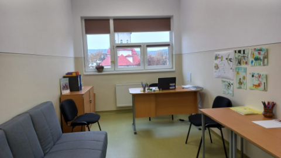

{.text-center}

 

 
 {.text-center}
*CABINETUL ȘCOLAR DE ASISTENŢĂ PSIHOPEDAGOGICĂ*
 {.text-center}

 *„Oamenii nu sunt tulburaţi de către lucruri, ci de modul în care ei privesc acele lucruri”*  - ***Epictet***

În DEX, consilier este explicat prin “sfătuitor, sfetnic; specialist care rezolvă probleme deosebite dintrun anumit domeniu”, a consilia – “a sfătui”, iar problemă – “chestiune teoretică sau practică importantă, care cere o rezolvare; dificultate, lucru greu de înţeles, de explicat sau de rezolvat”. Cuvântul “consilier” sugerează ideea de specialist, ceea ce conferă încredere. Cuvântul “problemă” sugerează ideea de “important, deosebit”, ceea ce presupune apelarea la cineva în care ai încredere că se pricepe, adică la un specialist. Consilierea este un proces complex, termenul de consiliere descriind relaţia interumană de ajutor dintre o persoană specializată (consilierul) şi o altă persoană/alte persoane care are/au nevoie de asistenţă în vederea unei dezvoltări armonioase (A. Băban, 2001) Consilierea psihologică este un proces de influenţare interpersonală reciprocă. Cu alte cuvinte, modul în care persoana care oferă ajutor (consilierul), răspunde solicitărilor clientului va influenţa în mare măsură evoluţia evenimentelor viitoare. Consilierea educaţională poate fi definită ca o relaţie interumană de asistenţă şi suport dintre persoana specializată în psihologia şi consilierea educaţională şi elevi, în scopul dezvoltării personale şi prevenţiei situaţiilor problematice şi de criză. Se axează pe triada familie-copil-şcoală, fiind preocupată de realizarea unei armonii între cei trei termeni ai relaţiei. Consilierea şcolară are două componente: consilierea psihopedagogică şi consilierea specifică orientării şcolare şi profesionale a elevilor. Cine vine la consiliere caută, în primul rând, o soluţie, o rezolvare pentru problema sa, indiferent de ce ordin ar fi aceasta, şi speră că aici găseşte răspunsul, că specialistul îi va oferi rezolvarea. S-ar putea ca în mintea acestuia să existe o soluţie, însă persoana nu este sigură dacă decizia sa este cea mai bună. Probabil că persoanele care vin la consiliere confirmă teoria conform căreia omul tinde spre binele său. Oamenii au conștientizat că nu pot deţine toate informaţiile, din toate domeniile, au aflat de progresele psihologiei ca știință, de importanța ei, de ajutorul pe care-l pot obţine de aici pentru a face faţă multitudinii de probleme care le bântuie viaţa, s-au convins că specialistul într-un domeniu este cea mai bună alegere, fie că este vorba de instalator sau de informatician. În al doilea rând, cel care vine la consiliere a aflat că psihologia este, în sens metaforic, ştiinţa sufletului. Probabil că a şi citit cel puţin un articol în domeniu şi a aflat că obiectivul major al acesteia este de a-i ajuta pe oameni să se cunoască mai bine, să se adapteze şi să acţioneze mai eficient. Este o chestiune de educaţie, de cultură, de mileniu III. Cel ce vine la consiliere are cel puțin o vagă idee cu ce “se mănâncă”, îi acordă, chiar fără să conștientizeze, un minim de încredere.
 

***CONSILIERUL ŞCOLAR***

TIPURI DE ACTIVITĂŢI:
{.text-center}

a) evaluarea şi diagnoza copiilor, tinerilor, membrilor familiei şi cadrelor didactice;

b) consiliere şcolară;

c) consiliere vocaţională;

d) intervenţie psihologică primară, secundară, terţiară;

e) consultanţă;

f) cercetare – în limita competenţelor sale;

g) consiliere şi intervenţie educaţională în instituţii, organizaţii şi comunitate.

Din acest an școlar (2023-2024), pentru că numărul mare de elevi o impunea, școala noasrtă a mai primit o jumătate de post de consilier, activităţile specifice fiind  asigurate de consilierii școlari ***Elena Neţan și Andreea Bota***.
