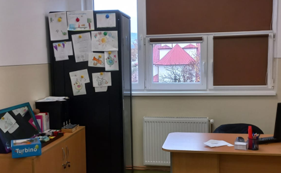

 
 {.text-center}

 CABINETUL LOGOPEDIC
{.text-center}

 Cabinetul logopedic din Şcoala Gimnazială Nr. 1 Bistriţa a fost înfiinţat în anul 2000. Este dotat cu mobilier nou, foarte modern, cu tehnologie şi aparatură de specialitate (jocuri, jucării, softuri, alte materiale educaţionale) de ultimă generaţie.
 
 Cabinetul de logopedie oferă următoarele servicii: 
• Prevenirea cauzelor care pot provoca tulburări de vorbire;
• Depistarea şi diagnosticarea timpurie a tulburărilor de vorbire; 
• Evaluarea limbajului prin metode şi procedee specifice; 
• Corectarea şi recuperarea tulburărilor de pronunţie prin aplicarea unor programe de intervenţie personalizată; 
• Evaluarea psihopedagogică, programe educaţionale şi terapeutic-recuperatorii individualizate pentru copiii cu dificultăţi de însuşire a citit-scrisului; 

Recomandarea logopedului: intervenţia logopedică este de preferat să se realizeze încă din grădiniţă, moment în care are loc structurarea şi dezvoltarea limbajului, evitându-se formarea şi consolidarea unor deprinderi greşite de vorbire sau chiar întârzieri în evoluţia firească a limbajului. 

**Logoped**, ***Liviu Cotuţiu***
