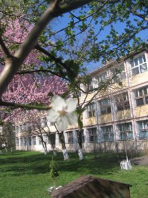

Școala Gimnaziala Nr. 1 Bistrita și-a deschis porțile în toamna anului 1964, istoria sa de 60 de ani, căpătând însă, an de an, o tot mai mare însemnătate în dezvoltarea învățământului din acest oraș. Cercetarea documentelor de arhivă evidențiază faptul că proiectul acestei școli era terminat în noiembrie 1963, sub nr.869/63, semnat de proiectant inginer Batizan Petru și director de proiect ing. Benran Nicolae. Proiectul cuprindea 16 săli de clasă, iar costul total, la acea vreme, era de 1.285.800 de lei. Amplasamentul era situat între str. Viișoarei și Împăratul Traian, pe un teren de 1,2 ha. Construcția școlii a început la 20 noiembrie 1964. Școala a fost dotată cu mobilier nou și cu material didactic. În anul înființării, școala a funcționat cu un număr de 514 elevi.

 {.text-center}

Elevii erau împărțiți în două clase paralele A și B, clasele B fiind experimentale. La acest clase, începând cu clasa I, fiecare disciplină era predată de un profesor de specialitate. Acest experiment s-a desfășurat până în anul 1972 și a avut ca școli pilot Școala Generală Nr.1 Bistrița și Școala Generală Sângeorz-Băi. Calitatea învățământului din acesta școala, dar și creșterea numărului populației școlare, a impus extinderea școlii cu încă o clădire, care a fost dată în folosință în anul 1980. Acest corp de clădire cuprinde 24 de săli de clasă, laboratoare de fizică, chimie și biologie, cabinete de specialitate, biblioteca școlii, secretariatul, direcțiunea și sala profesorală. Cel de-al treilea corp de clădire cuprindea 4 săli de clasa precum și sala de sport.

În toamna anului 2023 s-a dat în folosință clădirea reabilitată a școlii vechi, sala de sport nouă și extinsă, precum și corpul C reabilitat, toate clădirile beneficiind de dotări și funcționalități la standarde europene.

 {.text-center}

Primul director al scolii a fost domnul Pavel Purcelean. În anii 1979 - 1989, activitatea școlii a fost coordonată de domnul Ioan Măjeri, și director adjunct Alina Pop. În perioada 1989 - 2002, activitatea școlii este condusa de doamna Fironica Miclea, secondată de directorii adjuncți: Richard Zaig, căruia i-au urmat Alexandru Nagy, Vasile Platon, Vasile Moldovan, Gavril Câmpan și Iacob Brănișteanu. În aceasta perioada școala a trebuit să facă față rigorilor tranziției și ale reformei învățământului cu numeroase schimbări și dificultăți.

În perioada 2002-2016, activitatea școlii a fost coordonată de doamna Mia Șigovan, și de directorii adjuncți: Vultur Dorin, Elena Borș și Ancuța Mihaiu. Începând cu anul 2016 școala este condusă de director, prof. Ancuța Mihaiu și directori adjuncți Florin Poienaru, respectiv, Dana Moraru.

 {.text-center}

Din toamna anului 1990, odată cu terminarea construcției Școlii Generale Nr. 5 "Lucian Blaga", aproape 1000 de elevi ai școlii noastre au fost transferați la aceasta școală.

În anul școlar 2023/2024, la 60 de ani de la înființare, Scoala Gimnazială Nr.1 funcționează cu un număr de 52 clase, 1332 de elevi, împărțiți în 29 de clase la ciclul primar, 23 de clase la ciclul gimnazial.

Școala Gimnazială Nr. 1 Bistrița este o școală de elită, care pregătește generații de excepție, tineri valoroși pentru o societate care are nevoie de oameni competenți, competitivi, creativi, responsabili, empatici și posesori de valori morale și civice, capabili să se integreze într-o societate în continuă schimbare, adaptați la valorile democratice europene și globale, capabili să-și recunoască propria valoare, încrezători în forțele proprii, care să manifeste respect pentru sine și pentru ceilalți.

Școala Gimnazială Nr. 1 Bistrița este o școală deschisă comunității, oferă educație pentru toți  elevii în spiritul egalității de șanse și în dorința de a dezvolta o atitudine pozitivă a fiecărui elev pentru învățare, cu scopul de a fi mai bun în tot ceea ce face și de a tinde astfel spre excelență. Ea oferă un mediu stimulativ, creativ și confortabil în plan fizic și emoțional. Cadrele didactice ale școlii sunt educatori competenți, empatici și buni formatori de abilități de viață.
